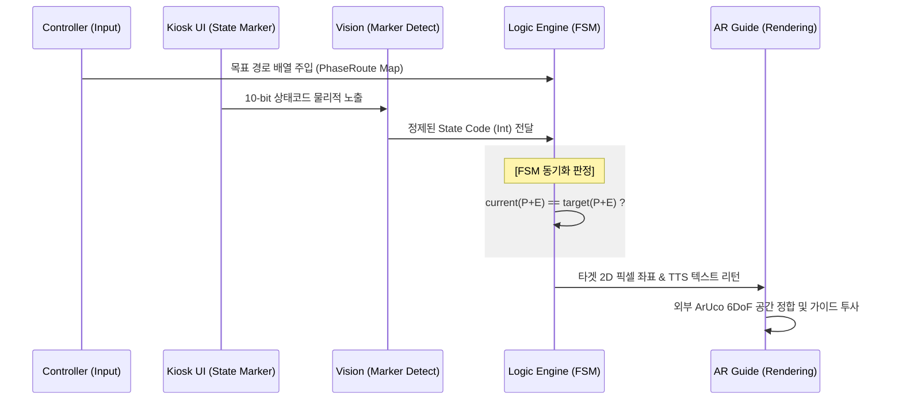

# [Core Logic] 10-bit FSM 기반 혼합현실(MR) 키오스크 로직 엔진

1. [전체 인터랙션 흐름도]
2. [상태코드 프로토콜 명세]
3. [이원화 마커 및 데이터 모델]
4. [엔진 제어 및 상태 동기화 규칙]
5. [예외 처리 및 자가 복구 룰]

---

## 1. 전체 인터랙션 흐름도

네트워크 통신 없이 시각적 매체(카메라)만으로 상태를 100% 동기화하는 온디바이스(On-device) 인터랙션 사이클입니다.

| 단계 | 위치 | 설명 |
|:---:|:---:|:---|
| ① 경로 주입 | 컨트롤러 | Meta Quest 3 컨트롤러 입력으로 타겟 메뉴의 `[Phase + Entity]` 목표 배열(Map) 생성 및 엔진 주입 |
| ② 노출 및 인식 | 키오스크 / Vision | 화면 전환 시 하단에 10-bit 마커 노출 → HMD 카메라가 인식 후 정수형 상태코드 변환 |
| ③ 상태 해석 | 로직 엔진 | 비트 마스킹을 통해 수신된 상태코드에서 현재 페이즈(Phase)와 엔티티(Entity)를 분리 및 확정 |
| ④ 검증 및 산출 | 로직 엔진 | 주입된 목표 배열과 **[현재 Phase + Entity]** 일치 여부 검증 후 타겟 2D 좌표 및 TTS 산출 |
| ⑤ AR 투사 | AR 파트 | 반환된 로컬 좌표를 화면 밖 외부 ArUco 마커의 6DoF 행렬에 투영하여 가이드 렌더링 |
| ⑥ 상태 전이 | 키오스크 UI | 사용자의 물리적 터치로 화면이 전환되며 다음 상태코드로 갱신 (루프 반복) |



---

## 2. 상태코드 프로토콜 명세

상태코드는 좌표 데이터를 포함하지 않으며, 오직 현재 화면의 논리적 상태만을 전달하는 순수 브릿지(State Bridge)입니다.

### 2-1. 비트 레이아웃 (Bit Layout)

상위 2비트로 시스템의 대단계를 정의하며, 하위 비트를 통해 구체적인 UI 오브젝트를 식별합니다.

| 비트 범위 | 필드명 (Key) | 비트 폭 | 설명 |
|:---:|:---:|:---:|:---|
| `[9:8]` | **Phase** | 2 bits | 시스템 대단계 (00, 01, 10, 11) |
| `[7:0]` | **Entity** | 8 bits | 해당 Phase 내의 구체적인 UI 옵션, 메뉴, 버튼 ID |

### 2-2. 상태 해석 규약 (Parsing)

로직 엔진 내 `StateCodeParser` 모듈을 통해 아래 비트 연산으로 값을 추출합니다.
```text
Phase  = (StateCode >> 8) & 0x03    → 결과 범위: [0, 3]
Entity = StateCode & 0xFF           → 결과 범위: [0, 255]
```

---

## 3. 이원화 마커 및 데이터 모델

### 3-1. 추적 레이어 분리 (Dual-Marker)
공간 정합의 안정성과 상태 동기화의 정확성을 확보하기 위해 추적 역할을 물리적으로 디커플링합니다.

| 분류 | 마커 유형 | 물리적 위치 | 핵심 역할 | 공학적 이점 |
|:---|:---:|:---:|:---:|:---|
| **Tracking Anchor** | **ArUco 마커** | 화면 외부 (베젤) | 3차원 공간 기준점 | 6DoF 좌표 제공, AR Swimming(흔들림) 방지 |
| **State Bridge** | **10-bit 마커** | 화면 내부 (LCD) | 논리적 상태 전이 | 0.1초 내 실시간 동기화, 네트워크 지연 제로 |

### 3-2. 페이즈(Phase) 데이터 딕셔너리

| 상태 코드 | Phase 구분 | 설명 및 화면 상태 |
|:---|:---|:---|
| `00x0000` | **Idle / Init** | 시스템 진입 전 대기 상태 (초기화) |
| `00 (0x00)` | **Phase 00** | **메뉴 선택 단계** (아메리카노, 카페라떼 등 카테고리/상품 선택) |
| `01 (0x01)` | **Phase 01** | **옵션 선택 단계** (수량 증감, 온도 변경, 샷 추가 등) |
| `10 (0x02)` | **Phase 10** | **결제 수단 선택** (신용카드, 현금, 간편결제 선택 화면) |
| `11 (0x03)` | **Phase 11** | **종료 및 회귀** (결제 완료 및 영수증 출력, 초기화 트리거) |

---

## 4. 엔진 제어 및 상태 동기화 규칙

로직 엔진은 기억(Memory)에 의존하지 않고, 들어오는 상태값과 주입된 목표값을 수학적으로 비교하여 가이드를 반환하는 무상태(Stateless) 결정론적 라우터입니다.

### 4-1. 상태 일치 판정 로직 (Lock-step Condition)

가이드 전이는 단순히 페이즈의 변화뿐만 아니라 **엔티티의 일치**를 전제로 합니다.

| 판정 결과 | 조건식 | 동작 처리 |
|:---|:---|:---|
| **정상 전이 (Success)** | `(currentP == targetP) && (currentE == targetE)` | 사용자가 정답 터치. 즉시 **다음 단계**의 타겟 좌표 로드 및 리턴 |
| **상태 유지 (On-track)** | `(currentP == targetP) && (currentE != targetE)` | 사용자가 미조작. 터치를 유도하도록 **현재 단계**의 가이드 유지 |

### 4-2. 설계 결단 (Design Trade-offs)
* **STT 모듈 대체:** 시연 환경의 불확실성 통제를 위해 STT 대신 Meta Quest 3 컨트롤러(`OVRInput`) 트리거를 사용하여 메뉴 경로를 주입(Mocking)합니다.
* **LLM 배제:** 실시간 응답성(0.1s 미만) 확보를 위해 네트워크 지연을 유발하는 외부 LLM API 대신 FSM 기반의 로컬 연산을 수행합니다.

---

## 5. 예외 처리 및 자가 복구 룰

사용자 오조작 및 센서 노이즈로 인한 시스템 데드락을 방지하기 위해 결정론적 집합 연산으로 통제합니다.

### 5-1. 경로 이탈 판별 (Phase Mismatch)

```text
if currentPhase not in 주입된_PhaseRoute_배열:
    예외 복구 시퀀스 발동(PhaseMismatch)
```
사용자가 엉뚱한 메뉴를 누르거나 뒤로가기를 잘못 눌러 시스템이 예상치 못한 화면에 진입했음을 확정합니다.

### 5-2. 자가 복구 시퀀스 (Self-Healing)

| 순서 | 조치 항목 | 세부 내용 |
|:---:|:---|:---|
| **1** | **Back Tracking** | JSON 데이터베이스에서 범용 `Back_Button`(뒤로가기)의 로컬 좌표를 호출하여 AR 투사 |
| **2** | **음성 개입** | 5초 간격으로 "이전 화면으로 돌아가주세요" TTS 반복 송출 유도 |
| **3** | **루프 복귀** | 사용자가 뒤로가기를 눌러 정상 Phase 배열 내로 진입하는 즉시 가이드 재개 |
| **4** | **Hard Reset** | 지속적인 복구 실패 또는 인식 불가 시, 컨트롤러 개입으로 시스템을 `00x0000`으로 초기화 |